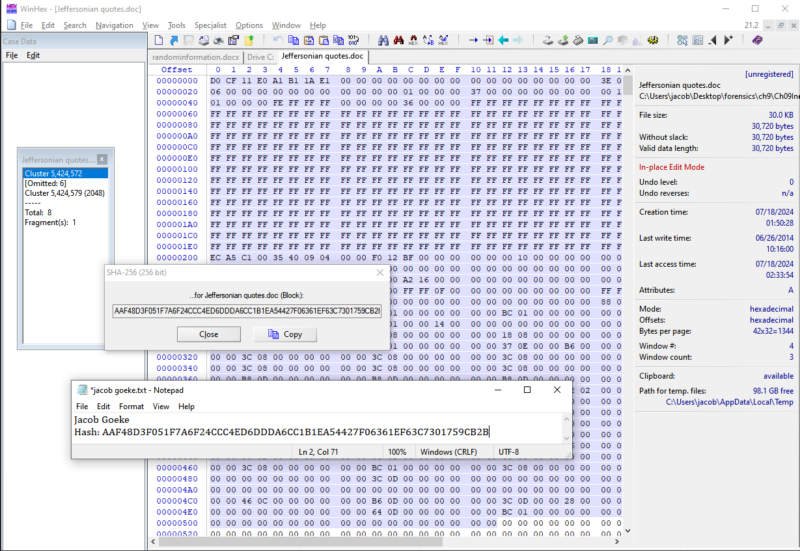
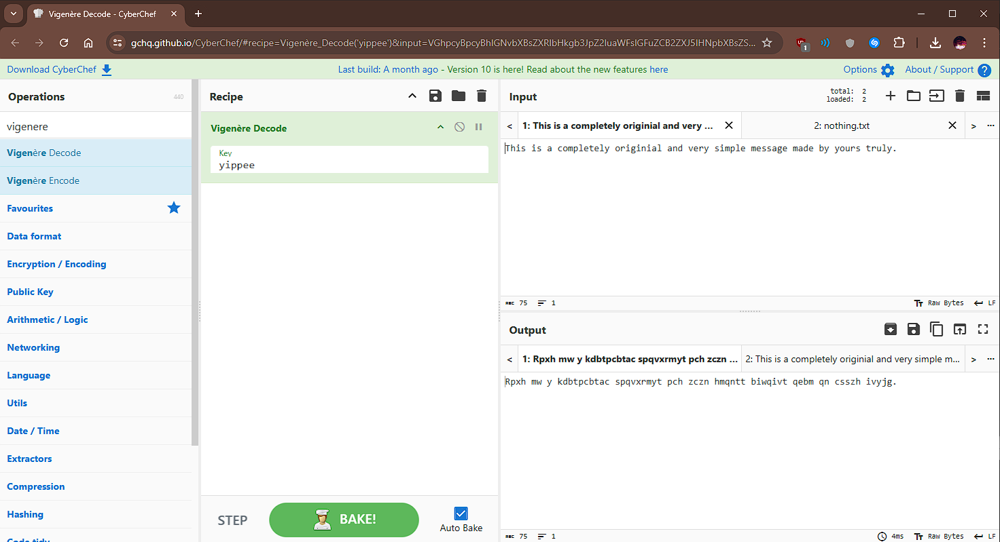
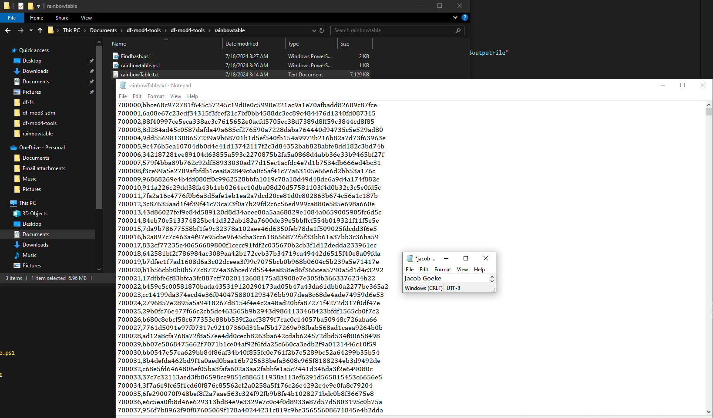

# df-mod4-tools

## Known Files Hash Databases

### Hash databases can be very helpful for identifying known files so that you do not have them in your way during your investigation. Below is an important hash database into the forensic investigation tool Autopsy.

## Known Bad Files in Hash Databases

### Known bad files in hash databases are important for investigators to pick up on evidence when performing an investigation. An attached screenshot is showing an example of a database created in Autopsy for known evidence files.

## Using a Hex Editor to View File Remnants

### We can examine files in a hex editor that have been deleted as long as the place in their drive has not overwritten the space that the file used to reside in. The screenshot below shows a hash computed from the first sector of a docx file.

## Bit Shifting

### Bit shifting can be used to encrypt files by shifting the bits a desired amount. This can keep your file secure but can also result in the loss of data. In digital forensics, a suspect may be using bit shifting to mask evidence and the investigator must be aware of ways to recover data that has been bit shifted. Attached is a screenshot of a bit shifted message. We can see the new message is nothing like the old one.

## Rainbow Tables

### Rainbow tables can be very useful in cracking passwords. They are essentially a respository of all password hashes, and the investigator must compare a suspected password hash to the repository and will be able to derive the password. Rainbow tables are easy to create with PowerShell and I used this rainbow table to match a few hash values to their passcode counterparts. Attached is a rainbow table.

